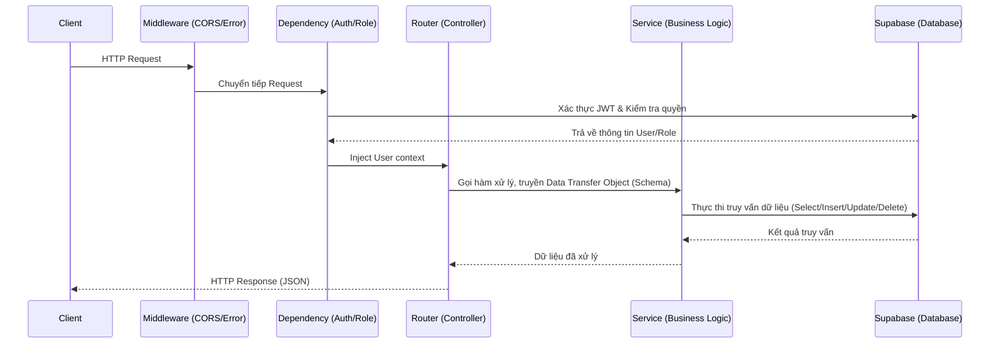

# Sơ Đồ Luồng API (API Flow)

Tài liệu này mô tả cách luồng dữ liệu hoạt động trong Backend (FastAPI). Kiến trúc Backend theo mô hình Layered Architecture nhưng tận dụng tối đa sức mạnh của FastAPI Dependency Injection.

## Luồng Hoạt Động Chung (General Flow)

## Các Tầng (Layers)

### 1. Middleware Layer
- **CORS Middleware**: Xử lý Cross-Origin Resource Sharing. Cấu hình tại `src/main.py`.
- **Exception Handler**: `ApiError` handler toàn cục trả về đúng chuẩn JSON thay vì lỗi crash hệ thống.

### 2. Dependency Injection Layer (`src/dependencies/`)
- Đây là tầng Middleware đặc thù của FastAPI.
- Trách nhiệm:
  - Lấy token từ Header.
  - Parse JWT Token.
  - Query DB để check quyền (Ví dụ: `get_current_user`, `get_trip_member`, `get_trip_owner`).
- Nếu lỗi, ném ra `HTTPException` hoặc `ApiError` ngay lập tức, chặn request đi tới Controller.

### 3. Controller / Router Layer (`src/routers/`)
- Nhận request đã đi qua Dependency.
- Parse và validate request payload bằng Pydantic Schemas (`src/schemas/`).
- Gọi Service.
- Trả về JSON cho Client.

### 4. Service Layer (`src/services/`)
- Chứa toàn bộ Business Logic (ví dụ: chia tiền - split expense, lên lịch trình - suggest itinerary).
- Tương tác với Supabase Python Client.
- Đóng gói dữ liệu trả về cho Router.

### 5. Repository (Supabase)
- Không có tầng Repository truyền thống (như SQLAlchemy ORM).
- Ứng dụng sử dụng trực tiếp Supabase Client (`db.table().select()...`) trong tầng Service. Điều này giúp tối ưu tốc độ phát triển.
