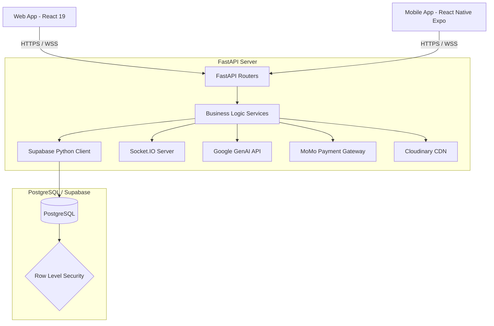

# Kiến Trúc Hệ Thống (Architecture)

Tài liệu này mô tả kiến trúc tổng thể của UsTrip, một ứng dụng quản lý chuyến đi đa nền tảng.

## 1. Sơ Đồ Kiến Trúc Tổng Thể

## 2. Các Thành Phần Chính

### 2.1. Frontend (Client Layer)
- **Web App**: Phát triển bằng React 19 + Vite. Đóng vai trò là nền tảng quản trị và sử dụng chính cho người dùng desktop.
- **Mobile App**: Phát triển bằng React Native Expo. Tối ưu cho trải nghiệm di động, bản đồ định vị và nhận thông báo Push Notification.

### 2.2. Backend (API Layer)
- Sử dụng **FastAPI** (Python).
- Cung cấp RESTful API và kết nối WebSocket (Socket.IO).
- Chịu trách nhiệm thực thi toàn bộ logic nghiệp vụ (chia tiền, xác thực, thanh toán, gọi AI).

### 2.3. Database (Data Layer)
- Sử dụng **Supabase (PostgreSQL)**.
- Quản lý dữ liệu quan hệ chặt chẽ. Đảm bảo toàn vẹn dữ liệu qua ràng buộc Khóa ngoại (Foreign Keys) và Triggers.

### 2.4. Các Dịch vụ Bên Ngoài (External Integrations)
- **Momo**: Cổng thanh toán điện tử cho việc đóng góp quỹ chung.
- **Google GenAI (Gemini)**: Phân tích và gợi ý lịch trình thông minh dựa trên AI.
- **Cloudinary**: Lưu trữ hình ảnh (ảnh bìa chuyến đi, ảnh hóa đơn, ảnh đại diện).
- **Expo Push Notifications**: Dịch vụ đẩy thông báo xuống thiết bị di động.

## 3. Luồng Hoạt Động Cụ Thể (Flows)

### Luồng Tải Hình Ảnh (File Upload Flow)
1. Client chọn ảnh và gọi API `POST /api/upload/{kind}`.
2. FastAPI nhận file qua `UploadFile`, kiểm tra dung lượng và định dạng.
3. FastAPI upload stream file lên **Cloudinary**.
4. Cloudinary trả về `secure_url`.
5. FastAPI lưu URL vào Database và trả URL về cho Client.

### Luồng AI Lên Lịch Trình (AI Flow)
1. Client truyền thông tin chuyến đi (Điểm đến, ngân sách, số ngày) vào `POST /api/trips/{tripId}/ai/itinerary`.
2. Backend prompt **Google Gemini API** để sinh danh sách các hoạt động dưới dạng JSON.
3. Backend phân tích chuỗi JSON trả về và tự động tạo các bản ghi vào bảng `itinerary_activities`.
4. Trả về kết quả trực quan cho Client.
