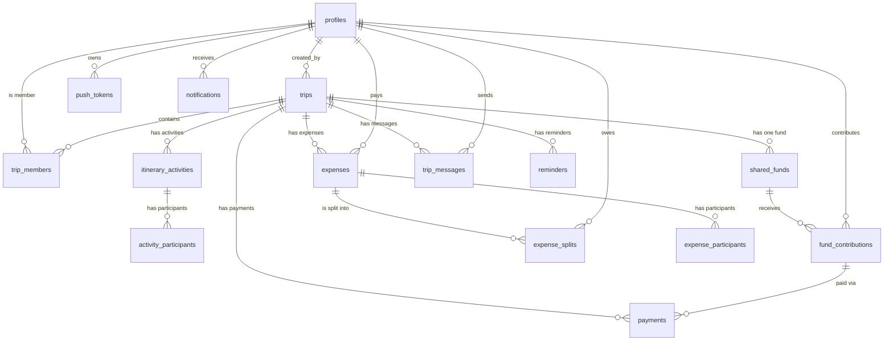

# Sơ Đồ Thực Thể Kết Nối (ERD)

Tài liệu này mô tả sơ đồ thực thể kết nối của cơ sở dữ liệu UsTrip, dựa trên `schema.sql` thực tế và các migration.

## Sơ đồ ER (Mermaid)

## Các Thực Thể Chính (Core Entities)

### 1. Người dùng và Phân quyền
- **profiles**: Chứa thông tin người dùng (email, full_name, avatar_url, phone).
- **push_tokens**: Lưu token thiết bị để gửi thông báo (Expo Push Token).

### 2. Quản lý Chuyến đi
- **trips**: Bảng trung tâm lưu trữ thông tin chuyến đi (name, destination, start_date, end_date, budget, cover_image).
- **trip_members**: Quản lý thành viên tham gia chuyến đi.
  - Mỗi thành viên có một role: `owner` hoặc `member`.
  - Quản lý trạng thái đóng góp quỹ chung: `contribution_status` (paid, partial, unpaid).

### 3. Lịch trình
- **itinerary_activities**: Hoạt động trong chuyến đi (title, date, location, coords, estimated_cost).
- **activity_participants**: Mapping ai tham gia hoạt động nào.

### 4. Quản lý Tài chính (Expenses & Shared Fund)
- **shared_funds**: Quỹ chung của chuyến đi (target_amount).
- **fund_contributions**: Thông tin đóng góp quỹ chung của từng thành viên.
- **expenses**: Khoản chi tiêu (category, payment_source, paid_by).
  - Có thể thanh toán bằng quỹ chung (`shared_fund`) hoặc cá nhân (`personal`).
- **expense_splits**: Khoản chia sẻ chi phí cho từng thành viên (amount_owed, is_settled).
- **expense_participants**: Mapping ai liên quan đến chi phí nào.
- **payments**: Giao dịch thanh toán thông qua cổng (ví dụ: MoMo). Trạng thái thanh toán (pending, success, failed).

### 5. Tương tác và Thông báo
- **notifications**: Thông báo trong ứng dụng cho người dùng.
- **reminders**: Nhắc nhở (thanh toán, lịch trình).
- **trip_messages**: Tin nhắn chat trong chuyến đi.
