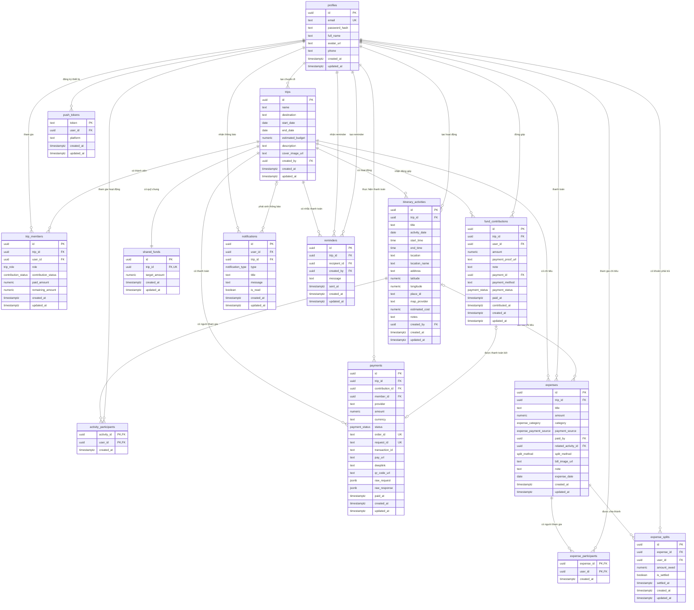

# ERD cơ sở dữ liệu UsTrip

Sơ đồ dưới đây bám theo cấu trúc hiện tại trong `database/schema.sql`.



## Các nhóm bảng chính

| Nhóm | Bảng | Vai trò |
|---|---|---|
| Người dùng | `profiles` | Lưu tài khoản, mật khẩu đã hash và hồ sơ |
| Chuyến đi | `trips`, `trip_members` | Lưu chuyến đi và thành viên thuộc chuyến |
| Lịch trình | `itinerary_activities`, `activity_participants` | Lưu hoạt động và người tham gia |
| Quỹ chung | `shared_funds`, `fund_contributions`, `payments` | Lưu mục tiêu quỹ, đóng góp thủ công và thanh toán MoMo |
| Chi tiêu | `expenses`, `expense_participants`, `expense_splits` | Lưu khoản chi, người sử dụng và kết quả chia tiền |
| Tương tác | `notifications`, `reminders` | Lưu thông báo và lịch sử nhắc thanh toán |

## Quan hệ quan trọng

### Người dùng và chuyến đi

`profiles` và `trips` có quan hệ nhiều-nhiều thông qua `trip_members`.

- Một người dùng có thể tham gia nhiều chuyến đi.
- Một chuyến đi có nhiều thành viên.
- `trip_members.role` xác định `owner` hoặc `member`.
- Cặp `trip_id`, `user_id` là duy nhất.

### Hoạt động và người tham gia

`itinerary_activities` và `profiles` có quan hệ nhiều-nhiều thông qua `activity_participants`.

Mỗi hoạt động thuộc đúng một chuyến đi và có thể liên kết với nhiều người tham gia.

### Chuyến đi và quỹ chung

`trips` và `shared_funds` có quan hệ một-một vì `shared_funds.trip_id` có ràng buộc unique.

Mỗi lần đóng góp được lưu độc lập trong `fund_contributions`, giúp giữ lịch sử giao dịch và ảnh minh chứng thanh toán.

### Chi tiêu và chia tiền

- Mỗi `expense` thuộc một chuyến đi.
- `payment_source=shared_fund`: trừ trực tiếp số dư quỹ, `paid_by` là `NULL`, không tạo `expense_splits`.
- `payment_source=personal`: thành viên trả hộ, `paid_by` xác định người đã thanh toán; `expense_participants` chỉ chứa những người cụ thể được trả hộ.
- `related_activity_id` là tùy chọn, dùng để liên kết khoản chi với hoạt động.
- `expense_participants` lưu đúng những người được thanh toán hộ; hệ thống không tự chọn toàn bộ thành viên chuyến đi.
- `expense_splits` chia đều khoản chi cho đúng danh sách `expense_participants`, đồng thời lưu số tiền mỗi người phải trả và trạng thái quyết toán.

Số dư quỹ chỉ được tính từ đóng góp thành công và khoản chi có nguồn `shared_fund`:

```text
Số dư quỹ = tổng fund_contributions thành công - tổng expenses có payment_source=shared_fund
```

### Thông báo và nhắc thanh toán

- `notifications` thuộc về một người dùng và có thể liên kết với chuyến đi.
- `reminders` lưu người nhận, người tạo và nội dung nhắc thanh toán.

## Enum đang sử dụng

| Enum | Giá trị |
|---|---|
| `trip_role` | `owner`, `member` |
| `contribution_status` | `paid`, `partial`, `unpaid` |
| `expense_category` | `food`, `transport`, `hotel`, `ticket`, `shopping`, `other` |
| `expense_payment_source` | `shared_fund`, `personal` |
| `split_method` | `equal` |
| `notification_type` | `contribution_reminder`, `new_expense`, `itinerary_update`, `member_added` |
| `payment_status` | `pending`, `success`, `failed`, `cancelled`, `expired` |

## Quy tắc xóa dữ liệu

- Phần lớn dữ liệu con sử dụng `ON DELETE CASCADE`.
- Khi xóa chuyến đi, thành viên, hoạt động, quỹ, đóng góp, chi tiêu và reminder liên quan sẽ được xóa theo.
- Khi xóa hoạt động, `expenses.related_activity_id` được đặt thành `NULL` để không làm mất lịch sử chi tiêu.
- Các tài nguyên chỉ được truy cập thông qua backend bằng service role. RLS được bật cho toàn bộ bảng và không có policy truy cập trực tiếp cho client.
